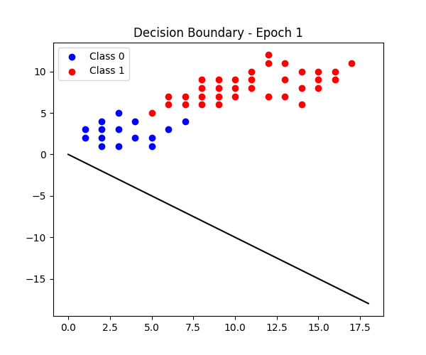

# perceptron_visual_learning

This project implements the Perceptron algorithm from scratch to understand how a linear classifier learns.

## Features

* Binary classification on 2D dataset
* Decision boundary animation across epochs
* Accuracy, precision, recall, F1-score evaluation
* Bias–Variance trade-off visualization

## How to Run

Open the notebook and run all cells.

## Notebook

perceptron_visual_learning.ipynb
## Learning Animation

